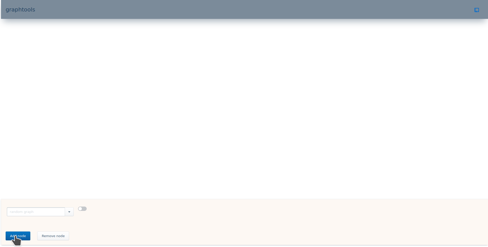

## Info
Go library for experimenting with graph algorithms
Can serve graph/algorithm results over websocket

## Websocket API
A bidirectional, synchronous, online, JSON API is defined for communicating
requests between the underlying graph and the user interface.

The server will only hold one structure at a time per client connection. In the
case of switching structures, the client must explicitly call the creation
method for that structure. Upon structure creation, the server will maintain the
new structure and allow the old one to be garbage collected.

### Client to server
Client-to-server requests take the following form:
```      
{
    structure: "data-structure-name",
    action: "action-to-perform",
    params: "params-to-pass-to-action",
}
```

The client should reference the datastructure/algorithm-specific API to know
what actions to call and associated parameters to provide. The parameters are
casted to the expected type on the server-side. Thus, an action call will fail
if the parameters are not able to be successfully converted. Be aware that this
may cause unexpected consequences if, for example a float is converted to an
integer.

### Server to client
Server-to-client responses take the following form:
```
{
    type: graph-structure-type,
    graph-manager-params...,
    graph: {
        numNodes: num-graph-nodes,
        numEdges: num-graph-edges,
        maxEdgeWeight: max-edge-weight,
        nodes: [
        {
            id: node-id,
            node-extra-data...,
            coords: node-coords,
            edges: [
            {
                weight: edge-weight,
                noderepr: [
                {
                    id: node-0-id,
                    tag: node-0-tag,
                },
                {
                    id: node-1-id,
                    tag: node-1-tag,
                },
                ]
            },
            ...
            ]
        },
        ...
        ]
    }
```

As you can see, the display should know about the
datastructure/algorithm-specific meaning of
graph-manager-params in order to provide a more rich graph display.
For example, in order to show the node color of a node in a red-black
tree. Otherwise, the graph can still be shown with default visual representation
provided that the UI understands the meaning of the default parameters.

## Display
[github.com/han-so1omon/graphtools-ui](https://github.com/han-so1omon/graphtools-ui)

## Demos


## TODO
- Order nodes and edges upon insertion in order to implement binary searching
- Algorithm demos
