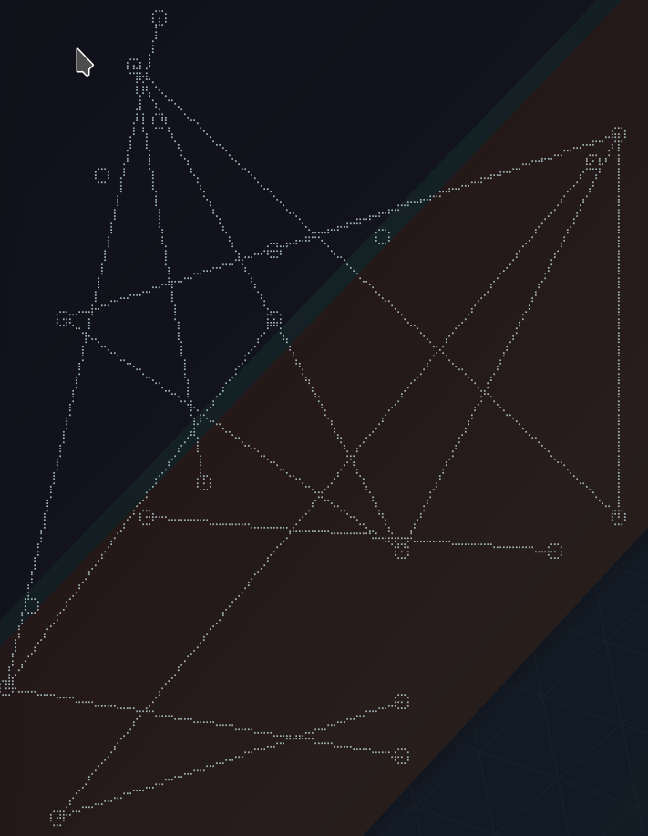
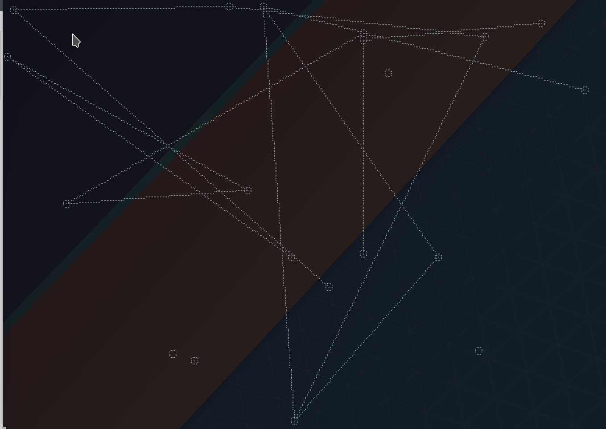
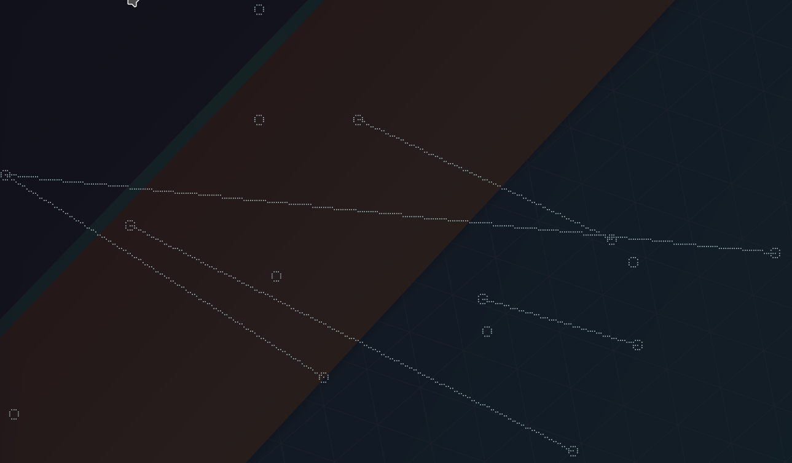
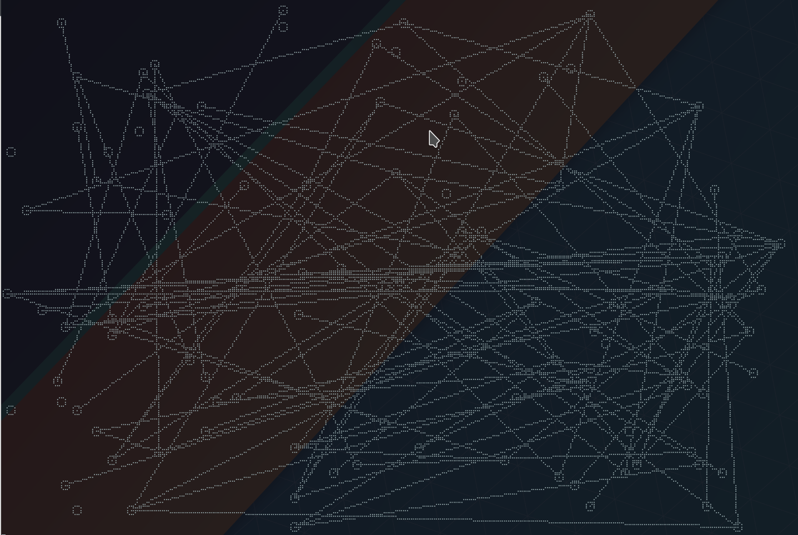

## Current status
- Generates random directional graph
- Serves graph over websocket
- Displays graph in terminal

## Info
Go library for experimenting with graph algorithms
Can serve graph/algorithm results over websocket

## Display
Includes a terminal display using [asciimoo/drawille](https://github.com/asciimoo/drawille)

## Demos

## TODO
- Order nodes and edges upon insertion in order to implement binary searching
- Generate graph from inputs
- Algorithm demos
- Generate bidirectional graph
- Modify display in terminal
